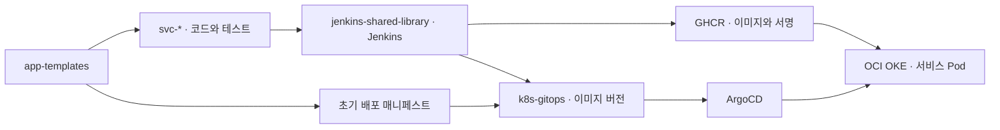

# ggang-platform

서비스 생성부터 테스트·이미지 검사·서명·GitOps 배포·운영 확인까지 연결한 **OCI OKE 기반 개인 Kubernetes 플랫폼**의 포트폴리오입니다.

**이 저장소는 아래 네 구현 저장소의 구조, 설계 결정, 실행 근거를 정리한 문서 저장소입니다.** 플랫폼 코드와 설정은 각 구현 저장소에서 관리합니다.

## 요약

| 관점 | 내용 |
|---|---|
| 제공 기능 | 5종의 서비스 템플릿으로 시작하고, 공통 CI에서 테스트·이미지 빌드·취약점 검사·서명을 거쳐 GitOps로 배포합니다. 배포 후에는 지표와 알림으로 상태를 확인합니다. |
| 구축 과정 | Terraform으로 OCI 기반을 구성하고, OKE 위에 Jenkins·ArgoCD·Istio와 관측 도구를 연결했습니다. 인프라·템플릿·CI·배포 설정을 네 저장소로 나눠 관리합니다. |
| 발전 과정 | 인프라 구성에서 서비스 생성·배포·운영 확인까지 범위를 넓혔습니다. GitOps 동시 갱신의 재시도와 서명 호환성을 다뤘으며, 실제 빌드 기록으로 테스트 실패 차단과 배포 버전 추적을 확인했습니다. |

이 플랫폼 위에서 일정 관리 웹을 제공하는 **5개의 작은 서비스로 구성한 MSA**를 운영합니다. 웹 진입점은 [www.ggang.cloud](https://www.ggang.cloud)이며, 서비스별 저장소는 [아래 표](#services)에 정리했습니다.

## 구현 저장소

| 저장소 | 담당하는 부분 |
|---|---|
| [oci-always-free-k8s](https://github.com/GGingGGang/oci-always-free-k8s) | Terraform으로 OCI 기반 구성, Kubernetes 플랫폼 설치·운영 설정 |
| [app-templates](https://github.com/GGingGGang/app-templates) | Go·Java·Node.js·JavaScript·Python 서비스 시작 템플릿과 생성기 |
| [jenkins-shared-library](https://github.com/GGingGGang/jenkins-shared-library) | 공통 테스트·이미지 빌드·검사·서명·배포 태그 갱신 |
| [k8s-gitops](https://github.com/GGingGGang/k8s-gitops) | 서비스 매니페스트·이미지 버전·ArgoCD Application |

**기여 범위:** 플랫폼 설계·구현·운영은 본인이 담당했습니다. Codex는 포트폴리오 문서 작성과 증빙 대조에 사용했습니다.

## 읽는 순서

이 페이지에서 프로젝트와 주요 결과를 살펴본 뒤, 1번부터 상세 내용을 읽을 수 있습니다. 각 문서 상단과 하단에 이전·다음 링크가 있습니다.

| 순서 | 문서 | 확인할 내용 |
|---|---|---|
| **0 · 현재** | **프로젝트 개요** | 목적·구현 저장소·기여·대표 결과 |
| 1 | [아키텍처](docs/01-architecture.md) | 네 저장소의 책임과 전체 연결 |
| 2 | [인프라](docs/02-infrastructure.md) | OCI 자원·클러스터·초기 설치 |
| 3 | [서비스 온보딩](docs/03-service-onboarding.md) | 템플릿 생성과 수동 준비 작업 |
| 4 | [CI/CD](docs/04-delivery.md) | 테스트부터 이미지·GitOps 갱신까지 |
| 5 | [네트워크](docs/05-network-entry.md) | 외부 요청의 DNS·TLS·라우팅 |
| 6 | [운영](docs/06-operations.md) | 관측·알림·데이터 보존·복구 |
| 7 | [설계 결정](docs/07-decisions.md) | 스택별 선택 이유와 대안 |
| 8 | [현재 상태](docs/08-status.md) | 클러스터·배포·운영 현황 |

[문서 목차](docs/README.md)에서 본문과 실행 근거를 바로 찾을 수 있습니다.

## 플랫폼 위의 서비스

일정 관리 웹과 이를 지원하는 서비스를 각각의 저장소로 관리합니다. 이 포트폴리오는 이들을 실행하는 인프라와 공통 배포·운영 과정을 중심으로 설명합니다.

| 저장소 | 역할 |
|---|---|
| [svc-web](https://github.com/GGingGGang/svc-web) | 일정 관리 웹 UI · [www.ggang.cloud](https://www.ggang.cloud) |
| [svc-auth](https://github.com/GGingGGang/svc-auth) | 회원가입·로그인·인증 |
| [svc-core](https://github.com/GGingGGang/svc-core) | 일정 API·텍스트 기반 일정 추출 |
| [svc-batch](https://github.com/GGingGGang/svc-batch) | 일정 이벤트 처리·리마인더 판정·통계 |
| [svc-notify](https://github.com/GGingGGang/svc-notify) | 알림 서비스의 기본 골격·상태 확인·메트릭 |

현재 사용자 대상 알림의 실제 발송은 비활성 상태입니다. 플랫폼 장애를 전달하는 Alertmanager → Discord 알림과는 별도 기능입니다.

## 프로젝트의 목적과 흐름

서비스마다 빌드·검사·배포 절차를 반복해서 작성하는 일을 줄이기 위해, 템플릿과 공통 CI, 배포 선언을 연결했습니다. OKE Basic과 ARM64 워커 두 대에서 서비스와 플랫폼 도구를 운영하며, Jenkins는 빌드할 때 agent Pod를 만듭니다.

외부 요청은 OCI NLB → Istio Gateway → HTTPRoute → Service → Pod로 전달됩니다. Prometheus·Grafana로 지표를 확인하고 Alertmanager를 Discord에 연결했습니다. 새 서비스에는 템플릿 생성 외에도 namespace·권한·Secret·CI 등록 작업이 필요합니다.

## 주요 설계 결정

| 선택 | 이유와 현재 제약 | 상세 |
|---|---|---|
| 인프라·템플릿·CI·배포 선언을 별도 저장소로 관리 | 변경 책임을 나눴으며, 저장소 사이의 버전과 규칙을 함께 관리해야 합니다. | [ADR-0001](docs/07-decisions.md#adr-0001) |
| Istio Ambient와 Gateway API | 공통 진입점과 서비스 Route를 분리하고, 앱 namespace에 Ambient를 적용했습니다. | [ADR-0004](docs/07-decisions.md#adr-0004) · [0005](docs/07-decisions.md#adr-0005) |
| 공통 CI와 GitOps 이미지 갱신 | 테스트·검사·서명 절차를 모으고 배포 버전을 Git에 기록합니다. | [ADR-0012](docs/07-decisions.md#adr-0012) · [0017](docs/07-decisions.md#adr-0017) |
| 코드 기반 플랫폼 설정 | 설치 설정을 Git으로 관리하며, 설정 복원과 런타임 데이터 보존을 구분합니다. | [운영의 상태 보존 범위](docs/06-operations.md#코드로-복원되는-것과-데이터) |

## 운영 중 다룬 문제

| 상황 | 처리와 확인한 결과 | 근거 |
|---|---|---|
| 서로 다른 서비스가 GitOps main을 동시에 갱신 | batch #23의 첫 push가 거부됐습니다. 최신 main에 batch 태그를 다시 적용해 push했고, 먼저 반영된 core 태그가 유지됐습니다. | [GitOps push 경합](docs/09-evidence/E03-2026-09-26-gitops-push-conflict.md) |
| cosign 서명과 Kyverno 검증의 호환성 문제 | 당시 검증 경로에 맞춰 cosign v2.4.1과 레거시 서명을 사용했습니다. 7/17 결정 기록에 PolicyReport PASS가 남아 있습니다. | [서명 호환성 결정](docs/07-decisions.md#adr-0015) |
| ArgoCD OutOfSync와 실행 상태가 다른 경우 | 9/30 auth·core·web의 차이는 HTTPRoute 참조 필드였습니다. 세 Route의 필드를 대조했으며, 다른 Application의 차이는 별도로 기록했습니다. | [플랫폼 CLI 관찰](docs/09-evidence/E05-2026-09-30-cli-observation.md) |

## 주요 결과

**2026-09-30 기준 운영 현황과 실행 결과입니다.** 각 기록에는 실행일과 대상 버전을 함께 남겼습니다.

| 대상 | 확인한 범위 | 실행 근거 |
|---|---|---|
| JavaScript 템플릿 | 새 임시 폴더에서 테스트 6/6·정적 빌드·Kustomize 렌더링 성공 | [템플릿 생성 검증](docs/09-evidence/E01-2026-09-30-template-generation.md) |
| batch #23 배포 | 9/26 소스 SHA·이미지 digest·GitOps 커밋·ArgoCD history와 9/30 실행 imageID 연결 | [배포 추적과 Jenkins 화면](docs/09-evidence/E02-2026-09-30-onboarding-deployment.md) |
| batch #13 실패 | 9/23 Test 단계의 Java 테스트 컴파일 실패 후 Build·Scan·Sign·Bump skip | [기존 CI 실패 차단](docs/09-evidence/E04-2026-09-30-ci-failure-boundary.md) |
| 클러스터·외부 접속 | 노드 2/2 Ready, Running Pod 52개 모두 컨테이너 Ready, 웹·core readiness HTTP 200 및 TLS 검증 성공 | [플랫폼 CLI 관찰](docs/09-evidence/E05-2026-09-30-cli-observation.md) |
| ArgoCD | 32 Healthy / 23 Synced / 9 OutOfSync. 차이는 Application별로 기록 | [관찰 기록과 ArgoCD 화면](docs/09-evidence/E05-2026-09-30-cli-observation.md) |
| 자원과 빌드 시간 | 워커 자원 표본과 batch·core·web별 최근 성공 빌드 5건의 duration 확인 | [자원·빌드 시간과 Grafana 화면](docs/09-evidence/E06-2026-09-30-platform-measurements.md) |
| OCI 비용 | 비용 조회 화면의 2026년 6~9월 월별 합계와 표시 기간 총합 0.00 SGD | [비용 조회 화면](docs/09-evidence/E06-2026-09-30-platform-measurements.md#비용-조회) |
| 장애 알림 | 9/24 batch TargetDown의 발생·해소 알림을 Discord에서 수신한 화면 확인 | [Discord 수신 기록](docs/06-operations.md#기존-targetdown-알림-수신) |

상세 운영 현황은 [8. 현재 상태](docs/08-status.md)에서 확인할 수 있습니다.

---

**다음 → [1. 아키텍처](docs/01-architecture.md)** · [전체 읽기 순서](docs/README.md)
