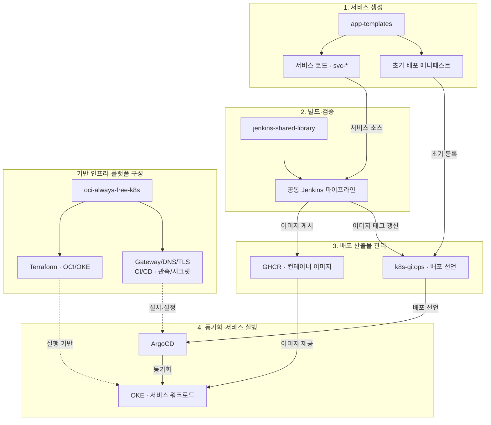
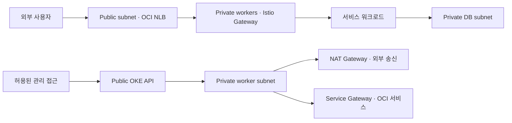
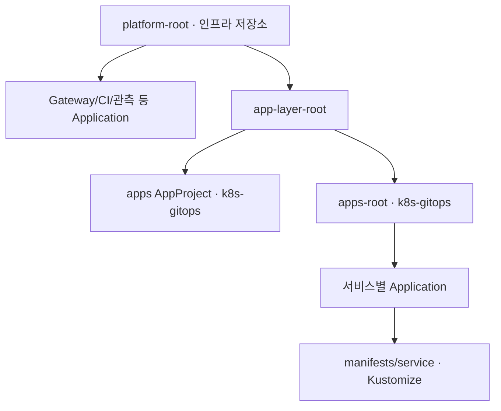

# 아키텍처: 플랫폼과 개발자의 경계

| 순서 | 문서 | 이동 |
|---|---|---|
| 0 | [프로젝트 개요](../README.md) | 이전 |
| **1** | **아키텍처** | **현재** |
| 2 | [인프라](02-infrastructure.md) | 다음 |

[0. 프로젝트 개요](../README.md) · [전체 읽기 순서](README.md) · [부록 목록](README.md#실행-기록과-원자료)

플랫폼의 변경 책임을 인프라·서비스 템플릿·공통 CI·앱 배포 선언의 네 저장소로 나눠 설계했습니다. `svc-web` 등 서비스는 직접 설계하고 AI로 구현했으며, 업무 로직은 각 서비스 저장소에서 관리합니다.

## 1. 저장소별 변경 책임

서비스 생성부터 실행까지의 논리 계층을 나타냅니다. 실선은 코드·설정·산출물의 흐름이며, 점선은 인프라의 설치·지원 관계입니다. Jenkins와 ArgoCD도 OKE에서 실행되며, 위 계층은 물리적 배치를 의미하지 않습니다.

| 원본 | 소유 범위 | 주된 변경 이유 |
|---|---|---|
| 인프라 저장소 | OCI 자원·클러스터·플랫폼 설치/운영 설정 | 환경·보안·운영 요구 변경 |
| 템플릿 저장소 | 언어별 서비스 생성 규칙 | 새로운 개발자 지원 또는 공통 규약 개선 |
| CI 라이브러리 | 빌드·검사·서명·배포 상태 갱신 | 공통 품질 게이트와 빌드 절차 변경 |
| GitOps 저장소 | 앱 리소스·이미지 태그·Application | 앱 버전 배포 또는 실행 설정 변경 |

플랫폼을 설치하는 ArgoCD 설정은 인프라 저장소에, 앱을 배포하는 Application/매니페스트는 GitOps 저장소에 있습니다. 관리 대상에 따라 설정의 소유 저장소를 나눴습니다.

## 2. OCI 네트워크와 외부 진입점

[networking 모듈][networking]은 공개 진입점, OKE API, 워커, DB 서브넷을 구분합니다. [OKE 모듈][oke]은 API endpoint를 공개 설정으로 생성하고, [IAM/NSG 모듈][iam]은 관리 접근 CIDR을 변수로 받습니다. 워커와 DB는 사설 서브넷에 배치합니다.

외부 애플리케이션 요청은 NLB를 거쳐 [Istio Gateway][gateway]에서 TLS를 종료합니다. [HTTPRoute][route]는 k8s-gitops에서 서비스별로 관리합니다. 웹 host와 API host를 분리하고, API 경로 prefix는 내부 전달 시 rewrite하도록 구성했습니다.

9/30에는 두 공개 readiness 경로의 DNS·TLS·HTTP 200과 Gateway/Route 조건을 확인했습니다. core 요청의 host·prefix rewrite·Service 연결은 [외부 요청 경로](05-network-entry.md), HTTPRoute의 Git/live 차이는 [CLI 관찰](09-evidence/E05-2026-09-30-cli-observation.md)에 정리했습니다.

## 3. ArgoCD 관리 계층

[platform-root][platform-root]가 플랫폼 Application을 읽고, [app-layer-root][app-layer]가 GitOps 저장소의 프로젝트와 앱 루트로 연결합니다. [apps-root][apps-root]는 서비스별 Application을 발견합니다.

앱 [AppProject][app-project]는 source repository와 destination namespace를 제한하고 cluster resource allowlist를 비워 둡니다. 허용 namespace 안의 리소스 종류는 넓게 열려 있어, 리소스별 권한 세분화는 남아 있습니다.

앱은 자동 동기화·prune·selfHeal을 사용합니다. [Jenkins Application][jenkins-app]에는 automated가 없으므로 수동 동기화 대상입니다. 구성요소의 재시작 비용에 따라 동기화 정책을 구분합니다.

## 4. 보안·관측의 적용 범위

| 구성 | 적용한 설정 | 운영 범위 |
|---|---|---|
| 네트워크 | public/private subnet, Security List, 관리 CIDR NSG | 공개 진입점·사설 워커/DB·관리 접근 분리 |
| TLS/DNS | Gateway 인증서 참조, cert-manager, external-dns | 공통 Gateway TLS 종료·Route 기반 DNS 관리 |
| 워크로드 보안 | namespace PSA와 ambient 라벨 | namespace별 적용, 빌드 환경의 별도 예외 |
| 이미지 공급망 | Trivy 게이트, digest 서명, 지정 이미지 admission 검증 | 공통 CI와 admission 정책의 적용 대상 |
| 시크릿 | Kubernetes Secret 참조, OpenBao/KMS 구성 | 초기 값 수동 주입·OpenBao 단일 replica/emptyDir |
| 관측 | Prometheus/Grafana/Alertmanager 구성 | 메트릭 조회·대시보드·Discord 알림 |

현재값과 제약은 [인프라 구현](02-infrastructure.md), 빌드/검사/배포 흐름은 [CI/CD](04-delivery.md)에서 설명합니다.

## 5. 운영 제약

- 템플릿·공통 CI·배포 선언이 별도 저장소에 있어 공통 규약의 호환성을 함께 관리합니다.
- 새 서비스의 namespace·권한·시크릿은 수동으로 준비합니다.
- 상시 플랫폼과 빌드 Pod가 작은 클러스터의 자원을 공유합니다.
- 런타임 데이터와 시크릿은 Git 설정과 별도로 보존·복구해야 합니다.

관련 결정: [ADR-0001](07-decisions.md#adr-0001).

## 6. 운영 현황

2026-09-30 기준 노드 2대와 실행 Pod 52개가 Ready였으며, ArgoCD의 32개 앱이 Healthy였습니다. 9개 OutOfSync 중 auth·core·web은 HTTPRoute만 차이를 보였습니다. 이 세 Route의 host·path·rewrite·backend는 일치하며, 차이는 live에 추가된 참조 필드였습니다.

같은 날 batch의 실행 imageID가 Jenkins #23에서 게시한 이미지 digest와 일치하는 것을 확인했습니다. CI부터 실행 버전까지의 연결은 [배포 추적](09-evidence/E02-2026-09-30-onboarding-deployment.md), 노드·Pod 자원 사용량은 [측정 기록](09-evidence/E06-2026-09-30-platform-measurements.md)에 정리했습니다.

[networking]: https://github.com/GGingGGang/oci-always-free-k8s/blob/bd4b1b787955f844a672ae2e369576108b3cec22/terraform/modules/networking/main.tf
[oke]: https://github.com/GGingGGang/oci-always-free-k8s/blob/bd4b1b787955f844a672ae2e369576108b3cec22/terraform/modules/oke/main.tf
[iam]: https://github.com/GGingGGang/oci-always-free-k8s/blob/bd4b1b787955f844a672ae2e369576108b3cec22/terraform/modules/iam/main.tf
[gateway]: https://github.com/GGingGGang/oci-always-free-k8s/blob/bd4b1b787955f844a672ae2e369576108b3cec22/kubernetes/infra/istio/gateway.yaml
[route]: https://github.com/GGingGGang/k8s-gitops/blob/3ef5320819bf94240db7d35924bd7858979d0167/manifests/core/httproute.yaml
[platform-root]: https://github.com/GGingGGang/oci-always-free-k8s/blob/bd4b1b787955f844a672ae2e369576108b3cec22/kubernetes/platform/argocd/root.yaml
[app-layer]: https://github.com/GGingGGang/oci-always-free-k8s/blob/bd4b1b787955f844a672ae2e369576108b3cec22/kubernetes/platform/argocd/apps/app-layer.yaml
[apps-root]: https://github.com/GGingGGang/k8s-gitops/blob/3ef5320819bf94240db7d35924bd7858979d0167/argocd/root.yaml
[app-project]: https://github.com/GGingGGang/k8s-gitops/blob/3ef5320819bf94240db7d35924bd7858979d0167/argocd/project.yaml
[jenkins-app]: https://github.com/GGingGGang/oci-always-free-k8s/blob/bd4b1b787955f844a672ae2e369576108b3cec22/kubernetes/platform/argocd/apps/jenkins.yaml

---

<!-- reading-nav -->
[← 0. 프로젝트 개요](../README.md) · [2. 인프라 →](02-infrastructure.md) · [전체 읽기 순서](README.md)
<!-- /reading-nav -->
