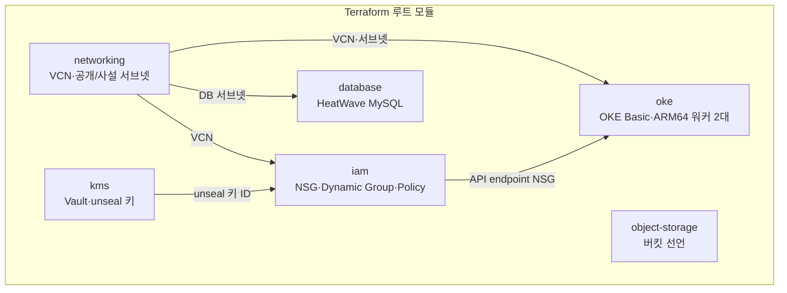
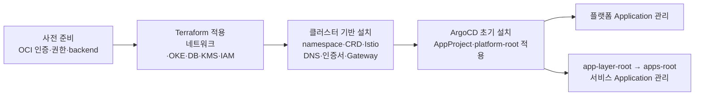

# 제한된 OCI 자원 위의 플랫폼 기반

| 순서 | 문서 | 이동 |
|---|---|---|
| 1 | [아키텍처](01-architecture.md) | 이전 |
| **2** | **인프라** | **현재** |
| 3 | [서비스 온보딩](03-service-onboarding.md) | 다음 |

[0. 프로젝트 개요](../README.md) · [전체 읽기 순서](README.md) · [부록 목록](README.md#실행-기록과-원자료)

## 문제와 목표

제한된 OCI 자원에서 서비스 빌드와 운영 도구를 함께 실행할 수 있도록 클라우드 자원·네트워크·클러스터를 구성했습니다. **구성의 원본을 코드로 관리하고, 공개 진입점과 사설 실행·데이터 영역을 분리했습니다.**

## 1. Terraform으로 관리하는 기반

[루트 모듈][tf-main]은 networking, OKE, database, KMS, IAM, object-storage를 연결합니다. [provider 설정][tf-provider]은 OCI remote backend를 사용합니다.

아래 화살표는 Terraform 모듈 사이에서 전달하는 값의 관계입니다.

object-storage는 독립 모듈이며, Terraform state를 저장하는 OCI backend는 별도로 준비합니다.

| 영역 | 구성 | 운영상 의미 |
|---|---|---|
| 워커 | A1.Flex 2대, 각 2 OCPU / 12GB | 빌드 Pod와 상시 플랫폼의 자원 경쟁 |
| 클러스터 | OKE Basic, Flannel overlay | 관리형 control plane과 직접 운영할 구성요소의 경계 |
| 네트워크 | 공개 LB/API, private workers/DB 분리 | 공개 진입점과 private 실행·데이터 영역의 분리 |
| 관리 접근 | OKE endpoint NSG에 allowed CIDR 변수 사용 | 환경별 관리 접근 범위 설정 |
| 상태 | OCI backend 선언 | state 저장소·접근 권한 별도 준비 |
| 데이터/키 | HeatWave, KMS와 IAM 연결 | DB·키 접근 권한 설정, DB 데이터는 별도 보존 필요 |

근거: [OKE 모듈][oke], [네트워크 모듈][networking], [IAM 모듈][iam].

워커는 단일 availability domain에 2대로 배치했습니다. OKE Basic·ARM64를 선택해 제한된 자원 안에서 관리형 control plane과 공통 배포 경로를 운영하며, ARM 이미지·도구 호환성과 공유 노드의 자원 경합을 고려합니다.

OCI 비용 조회에서는 2026년 6~9월의 월별 합계와 표시 기간 총합이 0.00 SGD였습니다. 조회 기간과 통화는 [비용 기록](09-evidence/E06-2026-09-30-platform-measurements.md#비용-조회)에 정리했습니다.

[Terraform CI][tf-ci]는 fmt → backend 없이 init → validate 순서로 구성 정적 검사를 수행합니다.

## 2. 부트스트랩과 GitOps의 경계

OCI 프로비저닝·클러스터 기반 설치와 이후의 GitOps 운영을 나눴습니다. 초기 기반을 설치한 뒤 ArgoCD에 플랫폼 Application과 앱 배포 선언을 연결합니다.

기반 설치는 namespace, Gateway API CRD, Istio, DNS·인증서 구성의 의존 순서를 따릅니다. 상세 명령은 [인프라 부트스트랩 문서][bootstrap], Application 관리 계층은 [아키텍처](01-architecture.md)에 정리했습니다.

초기 설치부터 GitOps 관리까지의 흐름입니다.

기반 설치에서는 Certificate의 `Ready=True`를 확인한 뒤 Gateway를 적용합니다. GitOps 연결 후의 자동·수동 동기화 여부는 각 Application의 설정을 따릅니다.

초기 설치에는 Git의 설정과 함께 시크릿·backend·클라우드 자격 증명을 준비해야 합니다.

### 실제 선행 관계와 수동 입력

| 순서 | 구성 | Git 밖에서 준비하거나 확인할 것 |
|---|---|---|
| 1 | Terraform backend·provider | OCI 인증·권한·backend 저장소와 접근 설정 |
| 2 | VCN/subnet → OKE·워커, DB·KMS·IAM | 환경별 변수·SSH 공개키·DB 초기 자격 |
| 3 | namespaces → Gateway API CRD | 앱·플랫폼 namespace와 정책 적용 범위 |
| 4 | Istio base → istiod → CNI → ztunnel | ARM64·Kubernetes/차트 버전 호환성 |
| 5 | external-dns·cert-manager | DNS provider Secret, Certificate Ready |
| 6 | 공통 Gateway | 인증서 Secret 참조; Ready 이전에는 listener 참조 실패 가능 |
| 7 | ArgoCD와 platform-root → app-layer/apps-root | 저장소 접근·사전 수동 Secret·AppProject destination |
| 8 | 앱·CI·관측 운영 | GHCR pull/push·서명키·알림 Secret, 서비스 등록 |

metrics-server와 Tailscale 관리 경로는 주된 인입 구성과 독립적으로 설치합니다. backend·초기 Secret·접속 권한은 코드와 별도로 관리하는 복구 입력입니다.

## 3. 공개 진입점·DNS·TLS

- Istio의 Gateway가 OCI NLB를 사용하도록 선언하고 HTTPS listener에서 인증서를 참조합니다.
- 서비스의 HTTPRoute가 host/path와 내부 backend를 선언합니다.
- external-dns는 Gateway HTTPRoute/GRPCRoute를 source로 사용해 Cloudflare DNS를 관리합니다.
- cert-manager의 ClusterIssuer/Certificate가 인증서 발급 구성을 소유합니다.

[external-dns 설정][dns]은 TXT ownership과 `policy: sync`를 사용합니다. 라우트 변경은 공개 DNS 변경으로 이어질 수 있으므로 host 변경·삭제도 운영 변경에 포함됩니다.

설정: [Gateway][gateway], [인증서 구성][certs]. DNS·TLS 접속과 HTTPRoute 상태는 [외부 요청 경로](05-network-entry.md)에서 확인할 수 있습니다.

## 4. 자원 제약과 상태 보존

| 구성요소 | 기준 설정 | 운영상 의미 |
|---|---|---|
| Jenkins | controller 실행기 0, 동적 agent cap 2, persistence 비활성 | 빌드는 agent에서 실행; 재시작 시 실행 중 빌드·비영속 상태에 영향 |
| OpenBao | Raft replica 1, emptyDir, KMS seal 설정의 환경별 값 필요 | 배포 시 값 주입; Raft 데이터는 Pod 교체 시 유실 가능 |
| Prometheus | 50Gi PVC 요청, 시간/크기 retention 설정 | retention에 따른 메트릭 보존; 장기 보존·백업 별도 구성 필요 |
| Grafana | persistence 비활성 | UI에서만 바꾼 설정은 Pod 교체 시 유실 가능 |

근거: [Jenkins values][jenkins], [OpenBao values][openbao], [모니터링 values][monitoring].

2026-09-30 실행 환경에서 Jenkins/Grafana/OpenBao/Redis의 주요 데이터 볼륨은 emptyDir, NATS·Prometheus의 50Gi PVC는 Bound였습니다. 구성요소별 보존 범위는 [운영](06-operations.md)에 정리했습니다.

JCasC로 Jenkins 설정을 복원하며, 실행 중 작업과 과거 로그는 별도 보존이 필요합니다. OpenBao는 `ha.enabled` 설정과 함께 replica 1을 사용하는 단일 인스턴스 구성입니다.

## 5. 보안과 관측

앱 namespace에는 ambient·PSA·이미지 검증 라벨이 있습니다. 모든 namespace가 동일 정책은 아니며 빌드 환경에는 별도 예외가 있습니다. [namespace 선언][namespaces]에서 범위를 확인할 수 있습니다.

Prometheus/Grafana로 메트릭을 조회하고, [Alertmanager의 Discord 수신 설정][alerts]으로 알림을 연결했습니다. 알림 수신 기록은 [운영](06-operations.md), 공급망 검사·서명·admission 흐름은 [CI/CD](04-delivery.md)에 정리했습니다.

애플리케이션과 플랫폼은 Kubernetes Secret을 참조하고, 초기 값은 수동으로 준비합니다. OpenBao로의 시크릿 이관은 남아 있는 작업입니다.

## 검증 결과

2026-09-30 기준 [노드·워크로드 상태](09-evidence/E05-2026-09-30-cli-observation.md)와 [자원·빌드 시간](09-evidence/E06-2026-09-30-platform-measurements.md)을 측정했습니다.

[tf-main]: https://github.com/GGingGGang/oci-always-free-k8s/blob/bd4b1b787955f844a672ae2e369576108b3cec22/terraform/main.tf
[tf-provider]: https://github.com/GGingGGang/oci-always-free-k8s/blob/bd4b1b787955f844a672ae2e369576108b3cec22/terraform/provider.tf
[oke]: https://github.com/GGingGGang/oci-always-free-k8s/blob/bd4b1b787955f844a672ae2e369576108b3cec22/terraform/modules/oke/main.tf
[networking]: https://github.com/GGingGGang/oci-always-free-k8s/blob/bd4b1b787955f844a672ae2e369576108b3cec22/terraform/modules/networking/main.tf
[iam]: https://github.com/GGingGGang/oci-always-free-k8s/blob/bd4b1b787955f844a672ae2e369576108b3cec22/terraform/modules/iam/main.tf
[tf-ci]: https://github.com/GGingGGang/oci-always-free-k8s/blob/bd4b1b787955f844a672ae2e369576108b3cec22/.github/workflows/terraform-ci.yml
[bootstrap]: https://github.com/GGingGGang/oci-always-free-k8s/blob/bd4b1b787955f844a672ae2e369576108b3cec22/kubernetes/infra/README.md
[dns]: https://github.com/GGingGGang/oci-always-free-k8s/blob/bd4b1b787955f844a672ae2e369576108b3cec22/kubernetes/infra/external-dns/values.yaml
[gateway]: https://github.com/GGingGGang/oci-always-free-k8s/blob/bd4b1b787955f844a672ae2e369576108b3cec22/kubernetes/infra/istio/gateway.yaml
[certs]: https://github.com/GGingGGang/oci-always-free-k8s/tree/bd4b1b787955f844a672ae2e369576108b3cec22/kubernetes/infra/cert-manager
[jenkins]: https://github.com/GGingGGang/oci-always-free-k8s/blob/bd4b1b787955f844a672ae2e369576108b3cec22/kubernetes/platform/jenkins/values.yaml
[openbao]: https://github.com/GGingGGang/oci-always-free-k8s/blob/bd4b1b787955f844a672ae2e369576108b3cec22/kubernetes/platform/openbao/values.yaml
[monitoring]: https://github.com/GGingGGang/oci-always-free-k8s/blob/bd4b1b787955f844a672ae2e369576108b3cec22/kubernetes/platform/monitoring/values.yaml
[namespaces]: https://github.com/GGingGGang/oci-always-free-k8s/blob/bd4b1b787955f844a672ae2e369576108b3cec22/kubernetes/infra/namespaces/namespaces.yaml
[alerts]: https://github.com/GGingGGang/oci-always-free-k8s/blob/bd4b1b787955f844a672ae2e369576108b3cec22/kubernetes/platform/monitoring/alertmanager-config.yaml

---

<!-- reading-nav -->
[← 1. 아키텍처](01-architecture.md) · [3. 서비스 온보딩 →](03-service-onboarding.md) · [전체 읽기 순서](README.md)
<!-- /reading-nav -->
