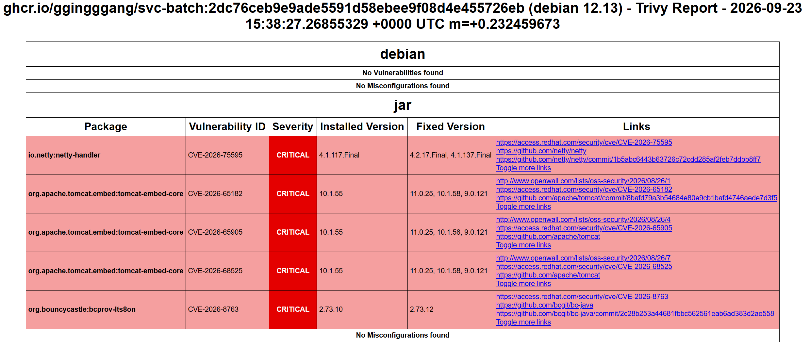

# 공통 CI와 GitOps 배포

| 순서 | 문서 | 이동 |
|---|---|---|
| 3 | [서비스 온보딩](03-service-onboarding.md) | 이전 |
| **4** | **CI/CD** | **현재** |
| 5 | [네트워크](05-network-entry.md) | 다음 |

[0. 프로젝트 개요](../README.md) · [전체 읽기 순서](README.md) · [부록 목록](README.md#실행-기록과-원자료)

## 문제와 구현 범위

개발자가 제출한 코드를 같은 기준으로 검증하고, 어떤 이미지가 어떤 선언을 거쳐 배포됐는지 추적할 수 있어야 합니다.

`jenkins-shared-library`는 공통 CI를, `k8s-gitops`는 앱의 원하는 배포 상태를 소유합니다. ArgoCD와 Jenkins의 설치·운영 설정은 인프라 저장소가 소유합니다.

## 1. 실제 파이프라인 순서

```mermaid
flowchart LR
    Source["개발자 소스 변경"] --> Test["Test"]
    Test --> Build["Build & Push · Kaniko"]
    Build --> Scan["Image Scan · Trivy"]
    Scan --> Sign["Sign · cosign"]
    Sign --> Bump["Bump · k8s-gitops"]
    Bump --> Sync["ArgoCD sync"]
    Sync --> Ready["워크로드 readiness"]
    Ready -. "별도 검증/후속 자동화" .-> Feedback["배포 완료 피드백"]
```

[ci.groovy][ci]의 순서는 `Test → Build & Push → Image Scan → Sign → Bump`입니다. 검사 게이트와 서명은 기본 설정에서 활성화됩니다. Jenkins는 현재 ArgoCD 건강 상태를 기다리거나 완료 피드백까지 제공하지 않습니다.

현재 기준에는 `post.failure`의 Alertmanager 알림이 추가되어 있습니다. 빌드 실패 알림이며 CD 완료 통지는 아닙니다. 입력 label·timeout·수신 경계는 [운영](06-operations.md)에서 설명합니다.

| 단계 | 구현 | 실패/완료의 의미 |
|---|---|---|
| Test | 등록된 language의 컨테이너와 명령 사용 | 실패하면 이미지 빌드에 진입하지 않음 |
| Build & Push | ARM64 이미지 빌드, 서비스 Git SHA 태그, digest 기록 | 이후 검사가 실패해도 registry에 이미지는 존재할 수 있음 |
| Image Scan | 기본 CRITICAL, unfixed 제외, JSON/HTML 보고서 | 설정된 게이트 실패 시 Bump로 진행하지 않음 |
| Sign | Kaniko가 기록한 digest에 서명 | 태그 문자열 자체가 아닌 빌드 산출물 digest를 대상으로 함 |
| Bump | 서비스 kustomization의 이미지 이름/태그 갱신 | GitOps에 배포 의도를 전달한 상태 |
| Sync / readiness | ArgoCD 적용과 Kubernetes 상태 확인 | CI 이후 적용 결과와 준비 상태를 별도로 확인 |

근거: [언어/서비스 설정][ci-config], [Kaniko 빌드][build], [Trivy 검사][scan], [cosign 서명][sign].

## 2. 언어별 테스트 계약

공통 CI는 서비스 이름으로 language를 찾고, language가 test image와 command를 결정합니다. 현재 서비스별 임의 테스트 명령 override를 두지 않습니다.

| language | 공통 게이트 |
|---|---|
| go | `go test ./...` |
| node | `npm ci && npm test` |
| java | `gradle --no-daemon test` |
| python | `python -m unittest discover -s tests -v` |

CI agent는 Docker 데몬 없는 환경을 전제로 합니다. 공통 CI는 언어별 테스트 명령을 실행하며, Docker가 필요한 통합 테스트는 개발자 저장소의 별도 실행 경로로 분리합니다.

ARM64 노드에서 실행할 test image와 서비스 빌더의 툴체인을 맞춰야 합니다. 버전을 바꾸면 라이브러리 설정과 템플릿을 함께 검토합니다.

## 3. 공급망 검사의 범위

Trivy의 기본 게이트는 CRITICAL을 대상으로 하고 unfixed를 제외합니다. 다른 심각도와 제외된 취약점은 이 게이트의 실패 판정 대상이 아닙니다. 보고서 파일이 없으면 스캔 자체의 실패로 처리합니다.

2026-09-23 별도 `svc-batch:2dc76ceb…` 보고서에는 Debian 항목의 취약점이 없고 JAR 의존성에서 CRITICAL 4건이 보입니다. 이는 [9/26 batch #23의 게이트 포함 0건](09-evidence/E02-2026-09-30-onboarding-deployment.md)과 다른 이미지·실행입니다. 이 화면에는 해당 Jenkins 빌드의 최종 결과가 포함되어 있지 않습니다.

서명 단계는 digest를 사용하지만, GitOps 배포 선언은 현재 SHA **태그**입니다. [Kyverno 정책][policy]은 `verify-images=true` namespace의 지정 이미지 패턴에 Enforce를 적용하며 `mutateDigest`와 `verifyDigest`는 false입니다. 서명 검증은 구성되어 있고, 배포 참조를 digest로 고정하는 작업은 남아 있습니다.

정책 검증에서는 적용 대상의 서명 없는 이미지가 거부되는지 확인해야 합니다. 키 주입·회전·예외 범위와 이미지 태그 변경의 영향도 별도 운영 과제입니다.

## 4. GitOps 갱신과 동시 변경

[deployBump][bump]는 `manifests/<service>/kustomization.yaml`의 이미지 이름/태그를 바꾸고 GitOps 저장소에 push합니다.

- 변경이 없으면 추가 커밋 없이 종료합니다.
- 동시 push 경합 시 최신 원격 상태를 가져와 해당 서비스의 변경을 재적용합니다.
- 재시도 횟수를 소진하면 실패로 종료합니다.

이는 다른 서비스의 동시 갱신을 보존하기 위한 처리입니다.

9/26 batch #23에서 실제 push 경합과 재시도 성공을 확인했습니다. [사례](09-evidence/E03-2026-09-26-gitops-push-conflict.md)는 첫 실패 커밋과 최종 push 커밋을 구분하고 core 태그 보존까지 대조합니다. 같은 job의 `disableConcurrentBuilds()`와 다른 서비스 간 경합 재시도는 서로 다른 보호 범위입니다.

앱 [Application][app]은 Kustomize 경로를 바라보고 자동 sync·prune·selfHeal을 사용합니다. 앱 루트와 플랫폼 루트의 연결은 [아키텍처](01-architecture.md)에 정리했습니다.

## 5. 한 배포를 추적하는 식별자

`서비스 커밋 SHA → GHCR 태그/digest → GitOps 변경 커밋 → ArgoCD revision → 실행 이미지 → readiness`

서비스 커밋 SHA와 ArgoCD가 읽는 GitOps 커밋 SHA는 다릅니다. 또한 [JCasC 설정][jenkins-values]에서 라이브러리는 현재 `main`을 기본으로 사용하므로, 빌드 절차의 재현을 위해 당시 라이브러리 revision도 기록해야 합니다.

배포 검증 기록에는 다음을 함께 남깁니다.

- 템플릿·공유 라이브러리·서비스 소스의 버전.
- GitOps 커밋과 ArgoCD가 적용한 revision.
- GHCR 이미지 digest와 실제 실행 이미지.
- 테스트/검사 결과, sync/readiness 결과, 시각과 실패 로그.

이 프로젝트에서 **Jenkins 성공은 배포 의도 전달까지**, **배포 확인은 실행 버전과 정상 상태까지**로 구분합니다. 별도 ArgoCD webhook이나 배포 완료 알림은 현재 공유 라이브러리에 구현되지 않았습니다.

## 6. 실패 처리와 복구 절차

| 시나리오 | 기대 결과 |
|---|---|
| 단위 게이트 실패 | 이미지 빌드 미진입 |
| 이미지 검사 실패 | 업로드 유무와 별개로 GitOps 태그 미변경 |
| 잘못된 namespace/destination | 배포 실패 원인을 ArgoCD에서 구분 가능 |
| pull Secret 누락 | 이미지 pull 실패를 빌드 성공과 구분 |
| 정상 이전 버전 선택 | GitOps 변경 → sync → 실행 이미지/readiness 재확인 |

이미지 되돌리기와 데이터 복원은 다릅니다. 플랫폼은 배포 버전을 되돌리는 경로를 제공하지만, 업무 데이터와 migration 호환성은 개발자와 확인해야 합니다.

또한 Jenkins의 persistence는 비활성화돼 있습니다. CI에 보관된 검사 보고서나 과거 로그를 장기 증빙으로 사용할 경우 보존 경로를 따로 확보해야 합니다.

## 7. 배포·운영 사례

| 항목 | 실행 기록 |
|---|---|
| 배포 버전 추적 | [batch #23](09-evidence/E02-2026-09-30-onboarding-deployment.md): 소스·라이브러리·이미지 digest·GitOps·ArgoCD history·Pod imageID |
| 테스트 실패 차단 | [batch #13](09-evidence/E04-2026-09-30-ci-failure-boundary.md): Test 컴파일 실패, Build/Scan/Sign/Bump skip |
| 동시 GitOps 갱신 | [경합 해결](09-evidence/E03-2026-09-26-gitops-push-conflict.md): 다른 서비스 변경 보존 후 재시도 성공 |
| 빌드·배포 소요 시간 | [측정](09-evidence/E06-2026-09-30-platform-measurements.md): 성공 5건씩의 duration·대표 배포 구간 |

batch #23의 Trivy 보고서는 당시 CRITICAL·unfixed 제외 조건에서 결과 0건이며, Gradle Test 단계는 성공했습니다. 검사 보고서와 console 원자료는 배포 기록에 연결했습니다.

[ci]: https://github.com/GGingGGang/jenkins-shared-library/blob/f762a6d841dc23bae11ace3628d5fb8d3b7c120d/vars/ci.groovy
[ci-config]: https://github.com/GGingGGang/jenkins-shared-library/blob/f762a6d841dc23bae11ace3628d5fb8d3b7c120d/resources/ci/services.yaml
[build]: https://github.com/GGingGGang/jenkins-shared-library/blob/f762a6d841dc23bae11ace3628d5fb8d3b7c120d/vars/kanikoBuild.groovy
[scan]: https://github.com/GGingGGang/jenkins-shared-library/blob/f762a6d841dc23bae11ace3628d5fb8d3b7c120d/vars/trivyImageScan.groovy
[sign]: https://github.com/GGingGGang/jenkins-shared-library/blob/f762a6d841dc23bae11ace3628d5fb8d3b7c120d/vars/cosignSign.groovy
[bump]: https://github.com/GGingGGang/jenkins-shared-library/blob/f762a6d841dc23bae11ace3628d5fb8d3b7c120d/vars/deployBump.groovy
[policy]: https://github.com/GGingGGang/oci-always-free-k8s/blob/bd4b1b787955f844a672ae2e369576108b3cec22/kubernetes/platform/kyverno/policies/verify-image-signature.yaml
[app]: https://github.com/GGingGGang/k8s-gitops/blob/3ef5320819bf94240db7d35924bd7858979d0167/argocd/apps/core.yaml
[jenkins-values]: https://github.com/GGingGGang/oci-always-free-k8s/blob/bd4b1b787955f844a672ae2e369576108b3cec22/kubernetes/platform/jenkins/values.yaml

---

<!-- reading-nav -->
[← 3. 서비스 온보딩](03-service-onboarding.md) · [5. 네트워크 →](05-network-entry.md) · [전체 읽기 순서](README.md)
<!-- /reading-nav -->
