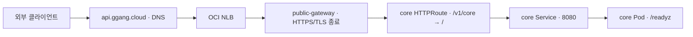
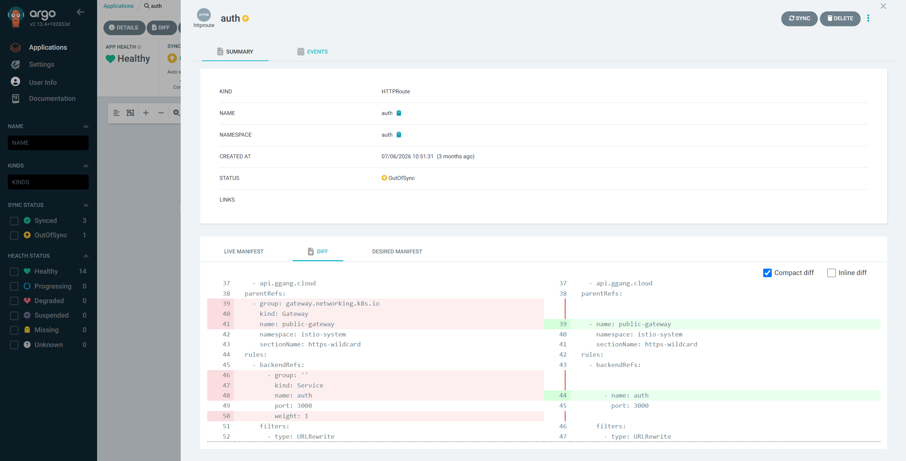

# 외부 요청과 플랫폼 네트워크

| 순서 | 문서 | 이동 |
|---|---|---|
| 4 | [CI/CD](04-delivery.md) | 이전 |
| **5** | **네트워크** | **현재** |
| 6 | [운영](06-operations.md) | 다음 |

[0. 프로젝트 개요](../README.md) · [전체 읽기 순서](README.md) · [부록 목록](README.md#실행-기록과-원자료)

서비스마다 ingress 구성을 처음부터 만들지 않도록, 플랫폼은 공통 TLS Gateway를 소유하고 앱은 HTTPRoute로 host·path·backend를 제출합니다. 관리 접속과 일반 서비스 요청은 다른 경로입니다.

## 대표 요청: core readiness

| 구간 | 설정·소유자 | 실패 시 먼저 볼 것 |
|---|---|---|
| DNS | 인프라의 external-dns, HTTPRoute hostname을 source로 사용 | 이름 조회, Cloudflare provider 권한·TXT ownership |
| NLB | 인프라 Gateway의 OCI NLB annotation | Gateway Programmed·Service endpoint·클라우드 LB 상태 |
| TLS | cert-manager Certificate → public-wildcard-tls 참조 | Certificate Ready·만료, listener ResolvedRefs |
| HTTPS listener | 인프라 public-gateway / https-wildcard | hostname·allowedRoutes·listener 조건 |
| HTTPRoute | GitOps manifests/core/httproute.yaml | Accepted·ResolvedRefs·parentRefs |
| prefix rewrite | /v1/core를 /로 치환 | 외부 /v1/core/readyz와 내부 /readyz 대응 |
| Service → Pod | GitOps Service 8080·Deployment·probe | selector·readiness·실행 imageID |

9/30 `https://api.ggang.cloud/v1/core/readyz`와 `https://www.ggang.cloud/readyz`에서 DNS 조회·TLS 인증서 검증·HTTP 200을 확인했습니다. [접속 원자료](09-evidence/data/2026-09-30-public-entry.json)는 응답 본문 없이 전송 계층과 상태 코드만 남깁니다.

## 웹 origin과 API origin

`www.ggang.cloud`의 `/`는 web Service 8080으로 전달됩니다. `api.ggang.cloud`의 `/v1/core`는 core:8080, `/v1/auth`는 auth:3000으로 전달됩니다. 플랫폼은 웹과 API의 origin을 분리한 라우팅을 제공합니다. JWT·CORS 내부 구현은 각 서비스의 영역입니다.

[Gateway 소스](https://github.com/GGingGGang/oci-always-free-k8s/blob/bd4b1b787955f844a672ae2e369576108b3cec22/kubernetes/infra/istio/gateway.yaml)와 [core HTTPRoute](https://github.com/GGingGGang/k8s-gitops/blob/3ef5320819bf94240db7d35924bd7858979d0167/manifests/core/httproute.yaml)가 각 경계를 소유합니다. Gateway는 다른 namespace의 Route 연결을 허용합니다. tenant별 세밀한 인가 정책은 별도 보강 항목입니다.

## OutOfSync와 라우팅 실패의 구분

9/30 관찰에서 auth·core·web은 HTTPRoute만 OutOfSync였습니다. live에는 참조의 group/kind와 backend weight=1이 추가되어 있으며, 이 필드를 보완하면 커밋된 spec과 일치합니다. host·path·rewrite·port는 일치하고 Route 조건도 정상이었습니다.

세 서비스의 차이는 live 참조 필드의 추가였으며, host·path·rewrite·port와 실행 이미지 버전은 일치했습니다. [필드 비교](09-evidence/data/2026-09-30-route-comparison.json)에 Git/live 값을 정리했습니다.

[auth 리소스 트리](../images/gitops/argocd-auth-httproute-status.png)에서는 Application이 Healthy/OutOfSync이고, HTTPRoute는 OutOfSync, Deployment는 Healthy/Synced로 표시됩니다.

아래 auth HTTPRoute Diff에는 live 참조의 `group`·`kind`와 `weight: 1`이 추가된 부분이 보입니다. 두 쪽의 Gateway 이름·namespace·listener와 backend 이름·port는 같습니다. 화면에 포함되지 않은 전체 host·path·rewrite와 core·web의 비교는 위 원자료에 있습니다.

## Istio와 관리 접속

Gateway는 외부 TLS 종료와 라우팅을 맡습니다. 별도로 앱 namespace에는 ambient 라벨이 있고, istiod·CNI·ztunnel이 준비 상태입니다. ingress TLS와 mesh 내부 mTLS는 서로 다른 구간입니다.

9/30 기준 PeerAuthentication·AuthorizationPolicy는 구성되어 있지 않습니다. 현재 적용 범위는 Ambient 연결이며, STRICT mTLS와 호출자별 접근 제어는 별도 정책이 필요합니다.

Terraform은 공개 OKE endpoint를 선언하며, 관리 PC의 kubeconfig는 사설 API 경로를 사용합니다. 관리 UI는 tailnet/port-forward를, 외부 서비스는 NLB를 거칩니다.

---

<!-- reading-nav -->
[← 4. CI/CD](04-delivery.md) · [6. 운영 →](06-operations.md) · [전체 읽기 순서](README.md)
<!-- /reading-nav -->
