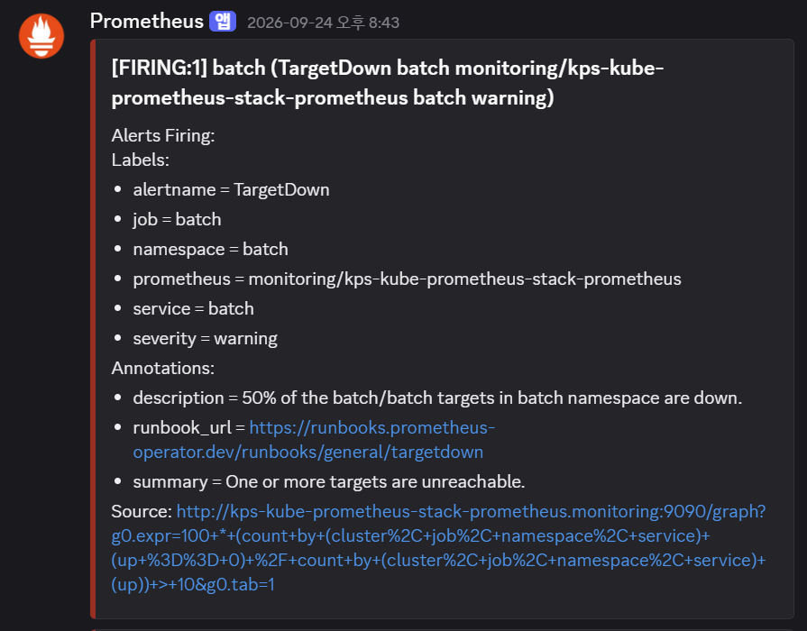
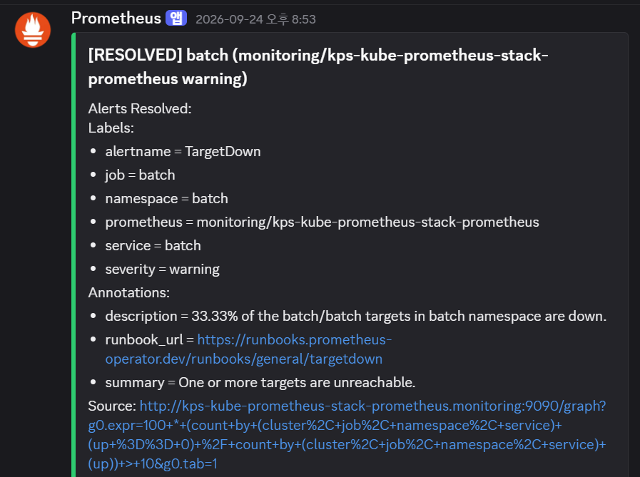

# 관측·운영·상태 보존

| 순서 | 문서 | 이동 |
|---|---|---|
| 5 | [네트워크](05-network-entry.md) | 이전 |
| **6** | **운영** | **현재** |
| 7 | [설계 결정](07-decisions.md) | 다음 |

[0. 프로젝트 개요](../README.md) · [전체 읽기 순서](README.md) · [부록 목록](README.md#실행-기록과-원자료)

운영에서는 이미지가 만들어졌는지, 선언이 적용됐는지, 프로세스가 준비됐는지, 사용자가 접근할 수 있는지를 따로 확인합니다. 현재 실행 근거는 [9/30 CLI 관찰](09-evidence/E05-2026-09-30-cli-observation.md)에 모았습니다.

## 상태 확인 순서

| 증상 | 먼저 읽을 대상 | 판정 |
|---|---|---|
| 빌드 실패 | Jenkins 단계·소스/라이브러리 revision | Test/Build/Scan/Sign/Bump 중 중단 위치 |
| CI 성공, 앱 반영 불명확 | GitOps 커밋 → ArgoCD history → Pod imageID | Jenkins 종료와 배포 완료 분리 |
| OutOfSync | Application resources의 차이 리소스 | Route 차이와 Deployment 이미지 차이를 구분 |
| 외부 접속 실패 | DNS → TLS → Gateway/Route → Service/Pod | 제어면 조건과 실제 GET 결과 대조 |
| 자원 부족 의심 | metrics API·노드 condition·Pod 사용량 | requests/limits와 사용량·호스트 영역 분리 |
| Helm failed | release history와 현재 관리 Application | 과거 실패 이력과 현재 장애를 구분 |

## 관측과 알림의 연결

9/30 기준 Prometheus·Grafana·Alertmanager·node-exporter·kube-state-metrics가 준비 상태였습니다. 클러스터 자원은 Grafana 대시보드에서 확인하며, 문서의 자원 표본은 **metrics-server API와 kubelet stats**를 기준으로 합니다.

[AlertmanagerConfig](https://github.com/GGingGGang/oci-always-free-k8s/blob/bd4b1b787955f844a672ae2e369576108b3cec22/kubernetes/platform/monitoring/alertmanager-config.yaml)는 namespace로 그룹을 묶고, groupWait 30초·groupInterval 5분·repeatInterval 12시간을 선언합니다. Watchdog은 null receiver로, 일반 알림은 Discord receiver로 보냅니다. webhook 값은 Secret 참조로 분리합니다.

Shared Library의 `post.failure`에는 `JenkinsBuildFailed`를 Alertmanager로 전송하는 로직을 구현했습니다. severity=warning, namespace=cicd, service/job/build 식별자와 10분 후 endsAt을 구성합니다. 연결·읽기 timeout은 각각 3초이고 전송 실패는 catch 후 로그에 남깁니다.

### 기존 TargetDown 알림 수신

2026-09-24의 Discord 화면에서 `batch`의 `TargetDown` 알림이 firing과 resolved로 수신된 것을 확인했습니다. 두 화면의 `namespace`, `service`, `job`은 모두 `batch`이고 `severity=warning`입니다.

| 화면 표시 시각 | 수신 상태 | 확인한 내용 |
|---|---|---|
| 2026-09-24 20:43 | FIRING:1 | batch TargetDown 경보 수신 |
| 2026-09-24 20:53 | RESOLVED | 같은 대상·종류의 해제 알림 수신 |

시각은 Discord 화면의 표시값이며 시간대 표기는 없습니다. 20:43과 20:53은 알림 수신 시각으로, 장애 시작부터 복구까지의 소요 시간과는 구분합니다.

## 관리 주체 확인

kps는 chart `75.0.0`과 Git values를 참조하는 ArgoCD multi-source Application이며 automated가 없습니다. Helm release 이력도 남아 있어, 변경 시에는 Application의 source·syncPolicy와 관리 주체를 확인해야 합니다.

9/30 `helm history kps`에서 7/25 revision 4의 `argocd-controller` 필드 충돌을 확인했습니다. 같은 관찰에서 kps Pod는 Ready이고 Application은 Healthy였습니다. 과거 failed 이력에 대해 Helm rollback을 실행하면 ArgoCD의 선언과 다시 충돌할 수 있습니다.

## 코드로 복원되는 것과 데이터

| 대상 | 소스 설정과 live 관찰 | 별도로 보존할 것 |
|---|---|---|
| Jenkins | JCasC, controller executor 0, 동적 agent cap 2; home emptyDir | 빌드 console·검사 보고서·운영 중 생성 상태 |
| Grafana | persistence=false, storage emptyDir | UI에서만 작성한 대시보드·설정 |
| OpenBao | Raft replica 1, data emptyDir, KMS seal 구성 | Raft 데이터·복구 입력·백업 |
| Redis | data emptyDir | Redis에 실제로 보관하는 상태의 복원 정책 |
| NATS | 50Gi PVC Bound | 메시지 보존 범위·볼륨 백업·복원 절차 |
| Prometheus | 50Gi PVC Bound, retention 15d/45GiB 선언 | 장기 보존·백업 요구 |
| 앱 이미지 | GitOps SHA 태그·서명 digest | registry 보존, DB migration과 이전 버전 호환성 |
| 클라우드/Secret | Terraform·참조 구조 | backend·인증 정보·수동 Secret·DB 데이터 |

emptyDir의 기록은 Pod 교체 시 유실될 수 있습니다. OpenBao auto-unseal은 잠금 해제를 담당하므로 Raft 데이터의 보존과 백업은 별도로 다룹니다.

## 복구 운영 기준

앱 버전 복구는 GitOps의 원하는 이미지 버전을 정상 버전으로 되돌린 뒤 ArgoCD와 실행 imageID를 확인하는 절차입니다. 앱 소스 저장소의 과거 상태만 checkout하거나 `rollout undo`만 수행하면 GitOps의 선언과 어긋날 수 있습니다.

복구 종료 조건은 정상 버전의 digest·readiness·필요한 접속 확인입니다. [batch #23 배포 기록](09-evidence/E02-2026-09-30-onboarding-deployment.md)처럼 정상 버전의 소스·이미지·배포 식별자를 연결해 기준점으로 남깁니다. DB 스키마 변경과 데이터 손상은 이미지 버전 복구와 별도로 처리합니다.

---

<!-- reading-nav -->
[← 5. 네트워크](05-network-entry.md) · [7. 설계 결정 →](07-decisions.md) · [전체 읽기 순서](README.md)
<!-- /reading-nav -->
