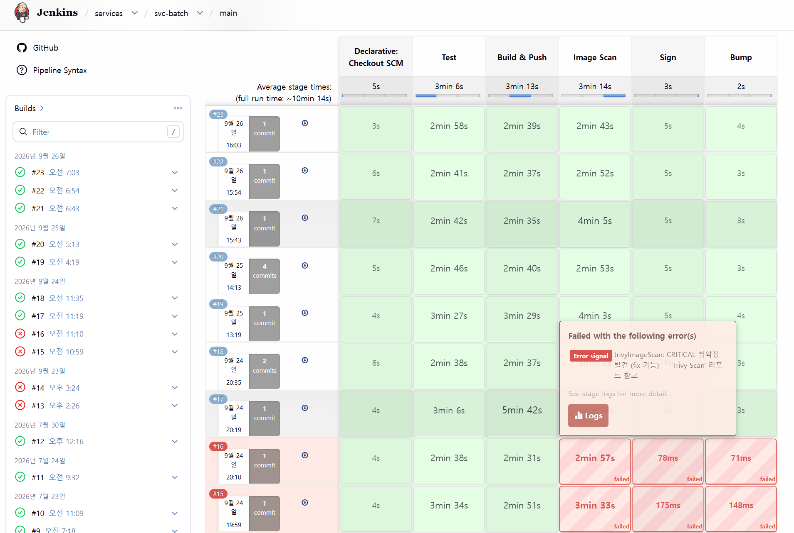
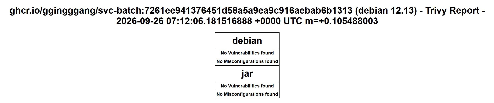

# 2026-09-30 기존 서비스의 배포 추적

| 순서 | 문서 | 이동 |
|---|---|---|
| E01 | [템플릿 생성 검증](E01-2026-09-30-template-generation.md) | 이전 |
| **E02** | **배포 추적** | **현재 부록** |
| E03 | [GitOps push 경합](E03-2026-09-26-gitops-push-conflict.md) | 다음 |

본문으로 돌아가기: [4. CI/CD](../04-delivery.md) · [부록 목록](../README.md#실행-기록과-원자료) · [0. 프로젝트 개요](../../README.md)

**svc-batch main #23의 소스·라이브러리·이미지·GitOps·실행 digest가 연결됩니다.** 2026-09-26 빌드에서 생성한 이미지가 ArgoCD 배포 history를 거쳐 9/30 클러스터에서도 같은 digest로 실행 중이었습니다.

## 근거와 식별자

| 경계 | 확인값 |
|---|---|
| Jenkins job | `services/svc-batch/main #23`, SUCCESS |
| 서비스 소스 | `7261ee941376451d58a5a9ea9c916aebab6b1313` |
| 당시 Shared Library | `07682be09bd5a6712602ad3efdb6fec58d6aabc5` |
| 이미지 태그 | `ghcr.io/ggingggang/svc-batch:7261ee941376451d58a5a9ea9c916aebab6b1313` |
| push·scan·서명·실행 digest | `sha256:b865855c6dc8e8d673eccf64aa26e99c754db8a2f71004cbc61b67ad4b1c6397` |
| 실제 push된 GitOps 커밋 | [f3a5222e64ab9b5d88c4ae1e8174492b7a595377](https://github.com/GGingGGang/k8s-gitops/commit/f3a5222e64ab9b5d88c4ae1e8174492b7a595377) |
| ArgoCD 배포 history | batch id 27, revision `f3a5222…`, `2026-09-26T07:13:40Z ~ 07:13:48Z` |
| 9/30 비교 revision | `3ef5320819bf94240db7d35924bd7858979d0167`, Synced / Healthy |
| 9/30 실행 | batch 컨테이너 Ready=True, restartCount=0, 위 imageID와 일치 |

ArgoCD의 **현재 비교 revision**과 해당 이미지 변경의 **배포 history revision**은 다릅니다. 이후 GitOps에 다른 변경이 들어와도 batch 이미지가 바뀌지 않을 수 있습니다.

원자료: [Jenkins 메타데이터](data/2026-09-30-jenkins-builds.json), [선별 console](data/2026-09-30-jenkins-console.json)의 svc-batch #23, [Trivy 집계](data/2026-09-30-batch23-scan.json), [ArgoCD·Pod](data/2026-09-30-runtime.json).

## 실행 순서

| UTC 시각 | 관찰 |
|---|---|
| 07:03:08.265 | Jenkins build timestamp |
| 07:06:34.683 | Test의 Gradle `BUILD SUCCESSFUL` |
| 07:09:24.269 | Kaniko가 위 최종 이미지 digest push |
| 07:12:03.793 | 보관된 Trivy JSON의 CreatedAt |
| 07:12:08.361 | cosign이 같은 digest에 서명 명령 실행 |
| 07:12:15.344 | GitOps 첫 push가 동시 변경으로 거부됨 |
| 07:12:17.450 | 최신 main을 기준으로 batch 변경을 재적용한 push 성공 |
| 07:12:17.921 | Jenkins timestamp + duration으로 계산한 종료 |
| 07:13:48 | ArgoCD batch 배포 history 완료 |

Test 단계는 Gradle `BUILD SUCCESSFUL`로 종료됐습니다. Trivy JSON에는 Debian과 Java 검사 결과가 있으며, **CRITICAL·ignore-unfixed 게이트에 포함된 취약점이 0건**입니다. 이 수치의 범위는 해당 심각도와 필터 조건입니다.

서명 단계는 cosign 명령 이후 Bump로 진행했으며 빌드는 SUCCESS로 종료됐습니다. 스캔 보고서의 ImageID는 이미지 config digest일 수 있으므로, 이미지 연결에는 **RepoDigests**와 Kaniko push digest·Pod imageID를 사용했습니다.

### Jenkins 실행 화면

**Jenkins #23 (2026-09-26 실행, 9/30 수집).** 맨 위 녹색 행에서 Test → Build & Push → Image Scan → Sign → Bump 성공을 확인할 수 있습니다. 실패 팝업은 아래쪽 과거 빌드에 해당합니다.

### Trivy 검사 화면

보고서의 이미지 SHA `7261ee941376451d58a5a9ea9c916aebab6b1313`과 2026-09-26 07:12 UTC 시각이 #23 기록에 대응합니다. Debian·JAR 항목 모두 보고된 취약점이 0건이며, 이는 위에서 설명한 CRITICAL·ignore-unfixed 검사 조건의 결과입니다.

## GitOps push 경합과 재시도

첫 push는 경합으로 거부됐고 Shared Library의 재시도로 성공했습니다. `7bc463b`는 첫 push가 거부된 로컬 커밋이며, 실제 배포 revision은 push에 성공한 `f3a5222`입니다. 재시도 과정과 core 태그 보존은 [문제 해결 사례](E03-2026-09-26-gitops-push-conflict.md)에 정리했습니다.

## 다른 워크로드와의 대조

9/30 커밋된 GitOps 태그와 실행 컨테이너 이미지가 일치합니다.

| 서비스 | 소스 SHA 앞 7자리 | 현재 ArgoCD | 실행 상태 |
|---|---|---|---|
| auth | db2ce86 | OutOfSync / Healthy | Ready |
| core | c0b013d | OutOfSync / Healthy | Ready |
| batch | 7261ee9 | Synced / Healthy | Ready |
| notify | 10478ab | Synced / Healthy | Ready |
| web | e67432f | OutOfSync / Healthy | Ready |

auth·core·web의 차이는 HTTPRoute에 한정되어 있습니다. [spec 대조](E05-2026-09-30-cli-observation.md)에서 차이를 함께 확인할 수 있습니다. 전체 소스 SHA·실행 digest는 원자료에 보관했습니다.

---

<!-- reading-nav -->
[← E01. 템플릿 생성 검증](E01-2026-09-30-template-generation.md) · [E03. GitOps push 경합 →](E03-2026-09-26-gitops-push-conflict.md) · [전체 읽기 순서](../README.md)
<!-- /reading-nav -->
