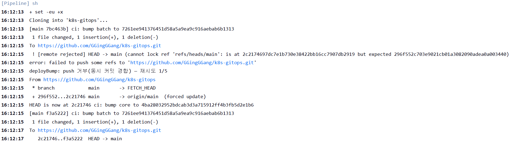

# 2026-09-26 GitOps 동시 push 경합 복구

| 순서 | 문서 | 이동 |
|---|---|---|
| E02 | [배포 추적](E02-2026-09-30-onboarding-deployment.md) | 이전 |
| **E03** | **GitOps push 경합** | **현재 부록** |
| E04 | [기존 CI 실패 차단](E04-2026-09-30-ci-failure-boundary.md) | 다음 |

본문으로 돌아가기: [4. CI/CD](../04-delivery.md) · [부록 목록](../README.md#실행-기록과-원자료) · [0. 프로젝트 개요](../../README.md)

2026-09-26, **batch 빌드가 GitOps에 push하는 동안 core가 main을 먼저 갱신했고, 공통 재시도가 core 변경을 보존한 채 batch 태그를 반영했습니다.**

## 증상과 원인

svc-batch #23의 Bump 첫 시도가 다음 오류로 거부됐습니다.

```text
[2026-09-26T07:12:15.344Z]
[remote rejected] HEAD -> main
cannot lock ref 'refs/heads/main':
is at 2c2174697dc7e1b730e38422bb16cc7907db2919
but expected 296f552c703e9021cb01a3082090adea0a003440
```

로그의 줄바꿈만 정리한 메시지입니다. 실패 시각에 원격 main이 바뀌었고, 최신 원격 커밋은 `ci: bump core to 4ba2803…`이었습니다. 원인은 같은 브랜치에 대한 동시 갱신이었습니다.

## 구현한 처리와 관찰

[당시 deployBump](https://github.com/GGingGGang/jenkins-shared-library/blob/07682be09bd5a6712602ad3efdb6fec58d6aabc5/vars/deployBump.groovy)는 push 실패 시 최신 원격 main을 fetch하고 **CI의 임시 clone**을 해당 버전으로 맞춘 뒤, 현재 서비스의 이미지 태그만 다시 수정합니다.

```text
[2026-09-26T07:12:13.970Z] [main 7bc463b] ci: bump batch to 7261ee9...
[2026-09-26T07:12:15.990Z] HEAD is now at 2c21746 ci: bump core to 4ba2803...
[2026-09-26T07:12:15.990Z] [main f3a5222] ci: bump batch to 7261ee9...
[2026-09-26T07:12:17.450Z] 2c21746..f3a5222 HEAD -> main
Finished: SUCCESS
```

로그 발췌의 태그는 축약 표기이며, 전체 식별자는 [선별 console](data/2026-09-30-jenkins-console.json)에 있습니다.

## 변경 보존 검증

9/30 Git 객체 대조에 사용한 명령입니다.

```bash
git -C k8s-gitops diff f3a5222^ f3a5222 --   manifests/core/kustomization.yaml manifests/batch/kustomization.yaml
git -C k8s-gitops show f3a5222:manifests/core/kustomization.yaml
```

| 대상 | 결과 |
|---|---|
| batch 태그 | `f484d628d76dc156fe95aacc031e6e25b16d0d5f` → `7261ee941376451d58a5a9ea9c916aebab6b1313` |
| core 태그 | `4ba28032952bdcab3d3a715912ff4b3fb5d2e1b6` 유지 |
| 성공 커밋의 변경 파일 | batch kustomization 한 개 |
| 후속 상태 | ArgoCD 배포 history 및 9/30 실행 digest가 연결됨 |



화면에는 재시도와 push 성공이 나타납니다. 최종 커밋의 Git diff에는 batch kustomization만 포함됐으며, core 태그는 유지됐습니다.

## 공통 처리의 범위

재시도 처리를 공통 Shared Library에 두어 서비스마다 별도 코드를 작성하지 않고 같은 경합 처리 경로를 사용하게 했습니다.

이 사례의 결과는 서로 다른 서비스의 변경 보존입니다. 같은 서비스의 오래된 빌드가 새 버전을 덮는 문제는 별도 범위입니다. push 루프는 최대 5회이며, 성공하지 못하면 빌드를 실패시킵니다.

---

<!-- reading-nav -->
[← E02. 배포 추적](E02-2026-09-30-onboarding-deployment.md) · [E04. 기존 CI 실패 차단 →](E04-2026-09-30-ci-failure-boundary.md) · [전체 읽기 순서](../README.md)
<!-- /reading-nav -->
