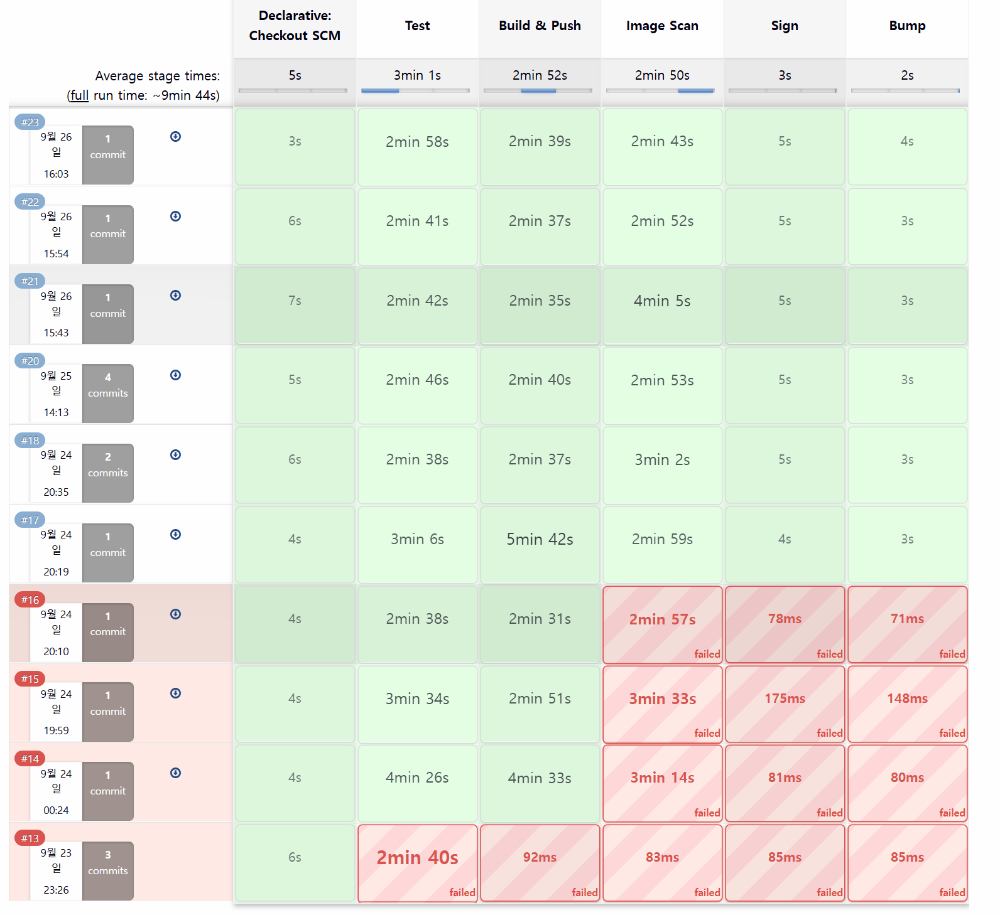

# 2026-09-30 기존 CI 실패 차단 기록

| 순서 | 문서 | 이동 |
|---|---|---|
| E03 | [GitOps push 경합](E03-2026-09-26-gitops-push-conflict.md) | 이전 |
| **E04** | **기존 CI 실패 차단** | **현재 부록** |
| E05 | [플랫폼 CLI 관찰](E05-2026-09-30-cli-observation.md) | 다음 |

본문으로 돌아가기: [4. CI/CD](../04-delivery.md) · [부록 목록](../README.md#실행-기록과-원자료) · [0. 프로젝트 개요](../../README.md)

2026-09-23 **svc-batch #13**은 Test 단계의 Java 테스트 소스 컴파일 오류로 실패했습니다. 이후 Build & Push·Image Scan·Sign·Bump가 모두 skip되어 해당 빌드의 이미지 생성과 GitOps 갱신이 중단됐습니다.

## 환경과 원자료

| 항목 | 확인값 |
|---|---|
| job | services/svc-batch/main #13 |
| 서비스 SHA | `b37c3e65511e79ee2a8fc762fb9e23de6bb21ffd` |
| Shared Library | `c5c20fe5430352b8699abf03f16b434cec55bdaa` |
| 시작 / 계산한 종료 | `2026-09-23T14:26:25.985Z` / `14:29:32.206Z` |
| 결과 | FAILURE, duration 186.221초 |
| 원자료 | [메타데이터](data/2026-09-30-jenkins-builds.json), [console 발췌](data/2026-09-30-jenkins-console.json) |

## 실패 로그와 후속 단계

```text
> Task :compileTestJava FAILED
error: incompatible types: try-with-resources not applicable to variable type
BUILD FAILED in 2m 38s
Stage "Build & Push" skipped due to earlier failure(s)
Stage "Image Scan" skipped due to earlier failure(s)
Stage "Sign" skipped due to earlier failure(s)
Stage "Bump" skipped due to earlier failure(s)
ERROR: script returned exit code 1
Finished: FAILURE
```

실패 지점은 assertion 실행 전의 **테스트 소스 컴파일**입니다. 공통 Test 게이트가 비정상 종료되면서 이미지 빌드와 배포 태그 갱신 단계로 진행하지 않았습니다.

`git log --all -S <위 서비스 SHA> -- manifests/batch/kustomization.yaml` 조회 결과에도 해당 SHA를 반영한 커밋이 없어, 이 빌드의 Bump skip 기록과 일치했습니다. Git 조회 범위는 로컬에 보존된 batch 이력입니다.

### 기존 빌드 화면

단계표에서 9/23 #13의 Test 실패와 9/26 #23의 전체 단계 성공을 확인할 수 있습니다. #13 후속 네 단계의 skip 여부는 위 console 발췌로 확인합니다.



[빌드 식별 화면](../../images/ci/jenkins-batch-13-build-detail.png)은 `services/svc-batch/main/#13`과 종료 코드 1을, [컴파일 오류 화면](../../images/ci/jenkins-batch-13-test-compile-error.png)은 `compileTestJava FAILED`와 `SimpleMeterRegistry`의 타입 오류를 보여줍니다.

## 결과

같은 빌드의 로그에서 Test 실패와 후속 네 단계의 skip이 이어집니다. 이 사례는 테스트 소스 컴파일 실패가 이미지 빌드와 GitOps 갱신 전에 차단된 경로를 보여 줍니다. 서로 다른 서비스의 동시 GitOps 갱신은 [batch #23의 push 경합 사례](E03-2026-09-26-gitops-push-conflict.md)에서 다룹니다.

---

<!-- reading-nav -->
[← E03. GitOps push 경합](E03-2026-09-26-gitops-push-conflict.md) · [E05. 플랫폼 CLI 관찰 →](E05-2026-09-30-cli-observation.md) · [전체 읽기 순서](../README.md)
<!-- /reading-nav -->
