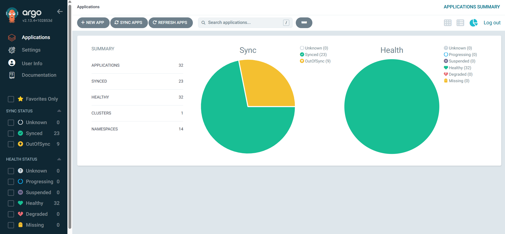

# 2026-09-30 플랫폼 CLI 관찰

| 순서 | 문서 | 이동 |
|---|---|---|
| E04 | [기존 CI 실패 차단](E04-2026-09-30-ci-failure-boundary.md) | 이전 |
| **E05** | **플랫폼 CLI 관찰** | **현재 부록** |
| E06 | [자원·빌드 시간](E06-2026-09-30-platform-measurements.md) | 다음 |

본문으로 돌아가기: [5. 네트워크](../05-network-entry.md) · [부록 목록](../README.md#실행-기록과-원자료) · [0. 프로젝트 개요](../../README.md)

2026-09-30 기준 Kubernetes·ArgoCD·Helm의 운영 상태입니다. 각 조회의 수집 시각은 원자료의 `observed_at`에 기록되어 있으며, 명령별로 차이가 있습니다.

## 도구와 수행 범위

| 도구 | 확인 결과 |
|---|---|
| kubectl | client `v1.36.0`, Kustomize `v5.8.1`; node server version `v1.34.2` |
| Helm | client `v4.1.4+g05fa379`; `helm list`·`helm history` 실행 |
| ArgoCD | client `v3.4.4+443415b`; `app list --core` 성공, 앱 32개 |
| Istio | Kubernetes 리소스·컨테이너 상태와 Helm 설치 이력 조회 |

```bash
kubectl --request-timeout=15s get nodes -o json
kubectl --request-timeout=15s get pods -A -o json
kubectl --request-timeout=15s get applications.argoproj.io -A -o json
kubectl --request-timeout=15s get gateway,httproute,certificate -A -o json
kubectl --request-timeout=15s get pvc -A -o json
kubectl --request-timeout=15s get networkpolicy,peerauthentication,authorizationpolicy,clusterpolicy,policyreport,hpa,pdb -A -o json
helm list --all-namespaces --output json
helm history kps -n monitoring --max 5 -o json
argocd app list --core --app-namespace cicd -o json
```

[runtime.json](data/2026-09-30-runtime.json)에 수집 명령, 시각, exit code와 조회 결과가 있습니다. 노드는 worker-1/2로 표기했습니다.

## 현재 관찰

| 항목 | 결과 | 의미 |
|---|---|---|
| 노드 | 2/2 Ready, ARM64, Kubernetes v1.34.2 | 현재 준비 상태 |
| Pod | 53개: Running 52 모두 컨테이너 Ready, Succeeded 1 | 작업 완료 Pod와 실행 Pod 구분 |
| ArgoCD | 32 Healthy, 23 Synced, 9 OutOfSync | Health와 선언 일치는 별개 |
| Gateway | Accepted=True, Programmed=True | listener 참조도 정상 |
| HTTPRoute | 6개, parent 조건 Accepted/ResolvedRefs=True | 조건과 실제 접속을 따로 확인 |
| Certificate | public-wildcard Ready=True | notAfter `2026-11-05T06:34:24Z` |
| PVC | NATS·Prometheus 각 50Gi Bound | 데이터 볼륨 연결 상태 |
| 이미지 정책 | verify-svc-image-signature Ready=True, PolicyReport 4개 pass=1 | 서명 정책과 현재 PolicyReport 상태 |
| 네트워크·확장 정책 | 조회한 NetworkPolicy·PeerAuthentication·AuthorizationPolicy·HPA 0개, PDB 1개 | Kubernetes 리소스 조회 결과 |
| Helm | 11개 release 중 10 deployed, kps revision 4 failed | 과거 release 상태와 live workload 구분 |

Istio base/istiod/cni/ztunnel의 Helm 기록은 1.29.3입니다. 설치 이력과 실제 컨테이너 이미지·Ready 상태는 원자료에서 각각 확인할 수 있습니다.

## OutOfSync를 리소스 단위로 해석

### ArgoCD 화면

**2026-09-30 촬영 화면입니다.** 32 Healthy, 23 Synced, 9 OutOfSync입니다. [전체 Application 목록](../../images/gitops/argocd-applications.png)에서 batch는 Synced/Healthy이고 auth·core·web은 OutOfSync/Healthy입니다. 리소스별 차이는 아래 표에 정리했습니다.



ArgoCD에서 OutOfSync로 표시된 리소스는 다음과 같습니다.

| Application | ArgoCD가 OutOfSync로 표시한 리소스 |
|---|---|
| auth・core・web | 각 HTTPRoute만 |
| jenkins-httproute | jenkins-webhook HTTPRoute |
| istio-gateway | public-gateway Gateway, http-to-https-redirect HTTPRoute |
| istiod | ValidatingWebhookConfiguration |
| kps | grafana Secret |
| kyverno | CRD 11개, controller Deployment 2개 |
| nats | StatefulSet |

auth·core·web은 live에 `parentRefs.group/kind`, `backendRefs.group/kind/weight`가 추가돼 있습니다. 이 관찰값을 Git spec에 보완하면 세 spec이 모두 일치합니다. host·path·port·rewrite가 다른 상황은 아닙니다. [비교 원자료](data/2026-09-30-route-comparison.json)에 양쪽 spec과 비교 결과를 남겼습니다.

kyverno·nats의 리소스 차이는 HTTPRoute와 별개로 남아 있습니다.

## 외부 진입 경로 확인

2026-09-30 09:27 KST, 로컬 PC에서 인증 없는 readiness GET을 실행했습니다.

| URL | DNS | TLS | HTTP |
|---|---|---|---|
| `https://www.ggang.cloud/readyz` | 주소 조회 성공 | TLSv1.3, 인증서 체인·hostname 검증 성공 | 200 |
| `https://api.ggang.cloud/v1/core/readyz` | 주소 조회 성공 | TLSv1.3, 인증서 체인·hostname 검증 성공 | 200 |

core의 prefix rewrite를 포함한 두 외부 readiness 경로에서 HTTP 200을 받았습니다. 상태 코드·TLS 버전·인증서 만료 시각은 [public-entry.json](data/2026-09-30-public-entry.json)에 있습니다.

## Helm failed의 경계

`kps`의 revision 4는 2026-07-25 Helm 적용 때 `argocd-controller`와 필드 소유 충돌이 발생한 이력입니다. 9/30 기준 kps는 Healthy이며 ArgoCD의 OutOfSync 대상은 grafana Secret입니다. [운영 문서](../06-operations.md)에서 관리 주체 확인 순서를 설명합니다.

---

<!-- reading-nav -->
[← E04. 기존 CI 실패 차단](E04-2026-09-30-ci-failure-boundary.md) · [E06. 자원·빌드 시간 →](E06-2026-09-30-platform-measurements.md) · [전체 읽기 순서](../README.md)
<!-- /reading-nav -->
