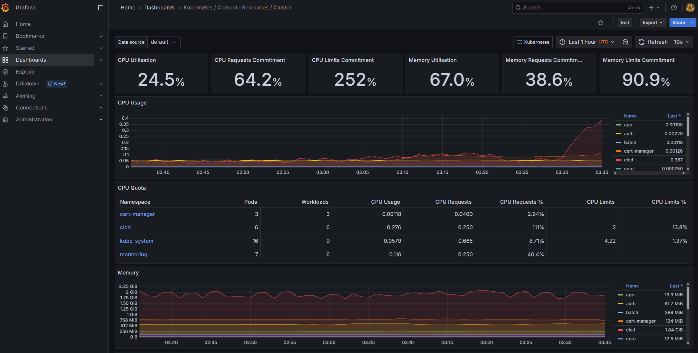
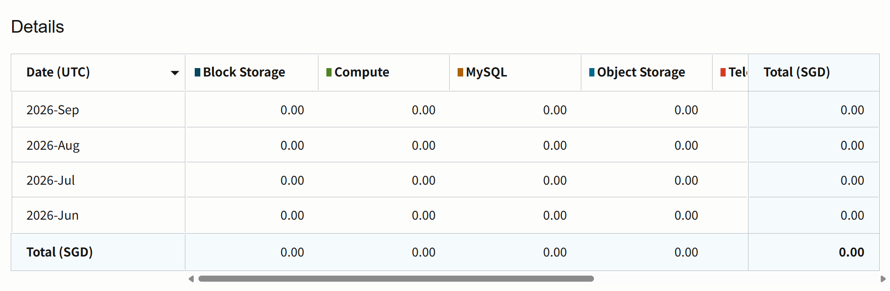

# 2026-09-30 자원과 빌드 시간

| 순서 | 문서 | 이동 |
|---|---|---|
| E05 | [플랫폼 CLI 관찰](E05-2026-09-30-cli-observation.md) | 이전 |
| **E06** | **자원·빌드 시간** | **현재 부록** |
| 8 | [현재 상태](../08-status.md) | 다음 |

본문으로 돌아가기: [6. 운영](../06-operations.md) · [부록 목록](../README.md#실행-기록과-원자료) · [0. 프로젝트 개요](../../README.md)

워커 2대의 자원 사용량, Jenkins 성공 빌드의 실행 시간, OCI 비용 조회 결과입니다.

## 워커 자원 표본

수집 시작은 09:17:53 KST입니다. metrics API timestamp는 worker-1 `00:17:42Z` / window 10.011s, worker-2 `00:17:49Z` / window 20.021s입니다. kubelet stats는 각각 `00:18:02Z`·`00:18:09Z`입니다. 서로 다른 시점·집계 창입니다.

| 지표 | worker-1 | worker-2 |
|---|---:|---:|
| allocatable CPU | 1830m | 1830m |
| allocatable memory | 9421.90Mi | 9421.84Mi |
| metrics CPU | 215.72m | 171.69m |
| CPU / allocatable | 11.79% | 9.38% |
| metrics memory | 8192.85Mi | 7808.23Mi |
| memory / allocatable | 86.96% | 82.87% |
| kubelet availableBytes 환산 | 3474.06Mi | 3841.17Mi |
| Pod working set 합계 | 4295.48Mi | 1701.20Mi |

원자료는 [metrics.json](data/2026-09-30-metrics.json)이며, 분모는 [runtime.json](data/2026-09-30-runtime.json)의 allocatable입니다. CPU는 nanocore를 millicore로, memory는 Ki를 Mi로 환산했습니다. 사용률은 각 사용량 / allocatable × 100입니다.

측정 당시 두 노드는 Ready이고 MemoryPressure/DiskPressure/PIDPressure=False였습니다. build namespace의 실행 Pod는 없었습니다. 노드 지표와 Pod working set 합계는 집계 범위가 다르며, 표에 각각 표시했습니다.

사용한 GET 경로:

```text
/apis/metrics.k8s.io/v1beta1/nodes
/apis/metrics.k8s.io/v1beta1/pods
/api/v1/nodes/<node>/proxy/stats/summary
```

## Grafana 자원 화면

**2026-09-30 약 12:38 KST 촬영 화면입니다.** 최근 1시간의 클러스터 CPU·메모리 대시보드입니다. 앞의 09:17 KST CLI 표본과 관찰 시점·집계 방식이 다릅니다.



## 보존된 성공 빌드의 시간

[Jenkins build.xml 선별값](data/2026-09-30-jenkins-builds.json)의 batch·core·web별 최근 성공 5건입니다. 각 빌드는 변경 내용·캐시·부하 조건이 다릅니다. 표에는 SUCCESS의 duration을 사용했으며, 실패·중단·UNSTABLE을 포함한 전체 목록은 원자료에 있습니다.

| 서비스 | 빌드 번호 | duration 초 | 중앙값 |
|---|---|---|---:|
| batch | #19~23 | 797.860 / 535.673 / 602.276 / 545.679 / 549.656 | 549.656초 |
| core | #27~31 | 333.672 / 374.353 / 507.151 / 308.869 / 263.018 | 333.672초 |
| web | #18~22 | 588.321 / 443.723 / 131.122 / 132.419 / 165.548 | 165.548초 |

duration은 Jenkins에 기록된 빌드 실행 시간이며, CI 등록 전 외부 대기·개발 시간은 포함하지 않습니다.

## 대표 배포의 두 시계

batch #23의 Jenkins timestamp는 `2026-09-26T07:03:08.265Z`, duration은 549.656초입니다. 마지막 GitOps push 성공은 console의 `07:12:17.450Z`, ArgoCD history 종료는 `07:13:48Z`입니다.

- ArgoCD 자체 history 구간: `07:13:40Z → 07:13:48Z`, 8초.
- GitOps push 성공 → ArgoCD history 종료: 약 90.55초.
- Jenkins timestamp → ArgoCD history 종료: 약 639.74초.

batch #23 한 건의 타임스탬프를 대조한 결과이며, 종료 기준은 ArgoCD history 완료 시각입니다. readiness는 9/30 조회 결과로 별도 확인했습니다.

## 비용 조회

Terraform은 ARM 워커 총 4 OCPU/24GB를 선언합니다. OCI 비용 조회 화면의 **2026년 6~9월 월별 합계와 표시 기간 총합은 0.00 SGD**입니다. 화면의 날짜는 UTC 기준입니다.



---

<!-- reading-nav -->
[← E05. 플랫폼 CLI 관찰](E05-2026-09-30-cli-observation.md) · [8. 현재 상태 →](../08-status.md) · [전체 읽기 순서](../README.md)
<!-- /reading-nav -->
